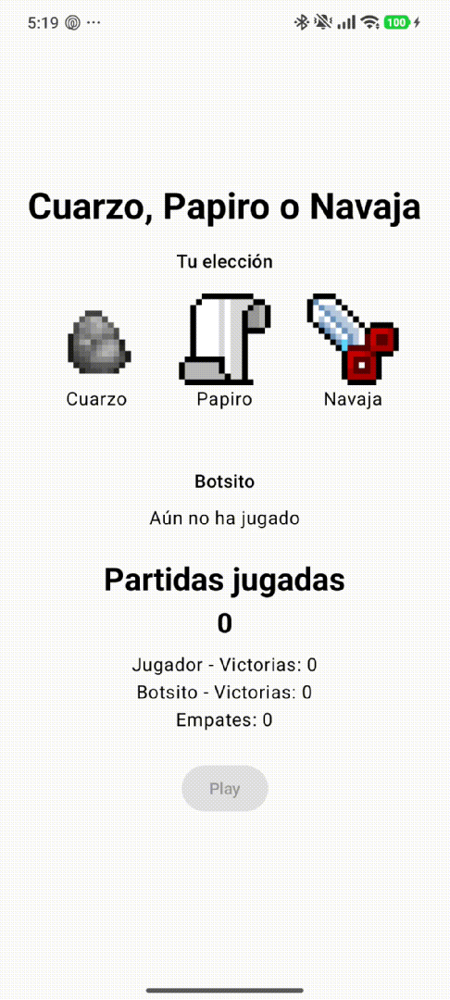

# Programación Orientada a Objetos II

Este repositorio será utilizado para la asignatura **Programación Orientada a Objetos II**.

## Propósito del repositorio

El objetivo de este repositorio es centralizar y organizar el desarrollo de los distintos trabajos realizados durante el curso, incluyendo:

- Tareas asignadas en clase
- Proyectos prácticos
- Ejercicios de programación
- Documentación relacionada con los temas estudiados

## Lenguaje de programación

Durante el desarrollo de la asignatura se trabajará principalmente con el lenguaje **Kotlin**, aplicando los principios y conceptos de la **Programación Orientada a Objetos (POO)**.

## Contenido

A lo largo del curso se irán agregando diferentes recursos, tales como:

- Implementaciones de conceptos de **Programación Orientada a Objetos**
- Ejercicios desarrollados en **Kotlin**
- Archivos de salida o resultados generados por los programas
- Documentación y explicaciones de los ejercicios desarrollados

## Organización del repositorio

Los ejercicios y proyectos estarán organizados en carpetas según la actividad correspondiente. Cada carpeta podrá contener:

- Código fuente
- Archivos de salida generados por los programas
- Documentación o descripciones del ejercicio

## Objetivo académico

Este repositorio servirá como:

- Registro del progreso durante el curso
- Evidencia del desarrollo de los ejercicios y proyectos
- Material de consulta para repasar los temas vistos en clase

## Índice de Proyectos

A continuación, se listan algunos de los proyectos desarrollados durante el curso:

1. **Cuarzo, papiro y navaja**
   - Primera práctica evaluada de la asignatura
   - App sencilla que simula el juego de cuarzo, papiro y navaja
   - Implementa un bot sencillo que cumple con el rol del oponente
   

      
Ver preview

   
      
   
    

      

---

**Asignatura:** Programación Orientada a Objetos II  
**Lenguaje utilizado:** Kotlin  